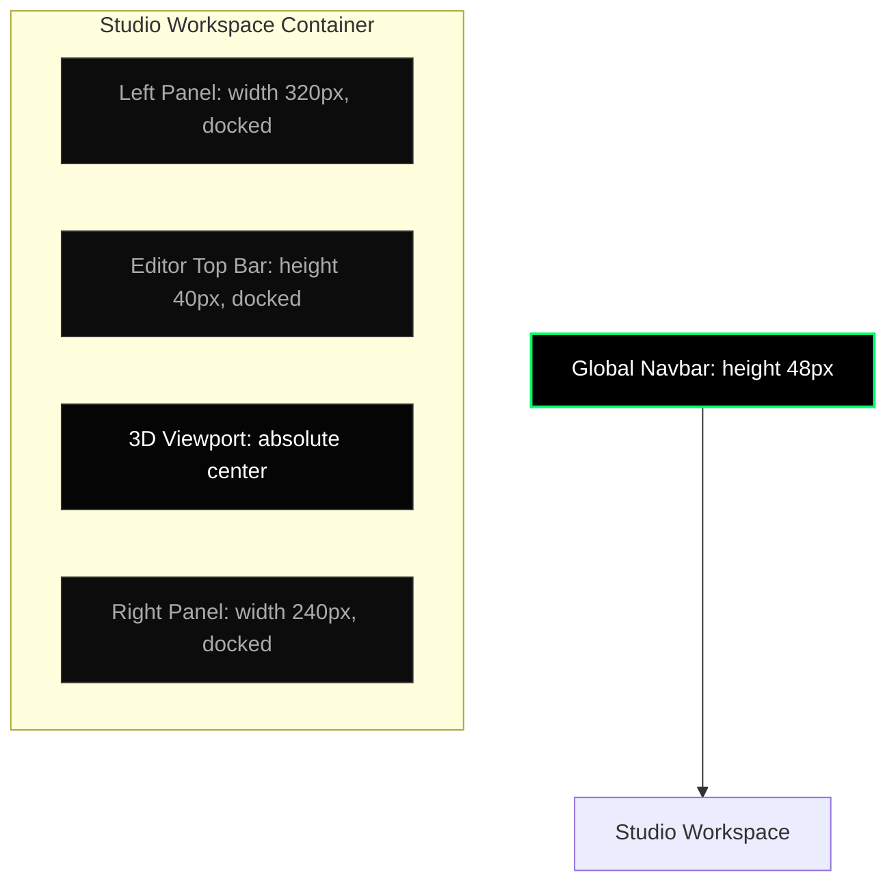
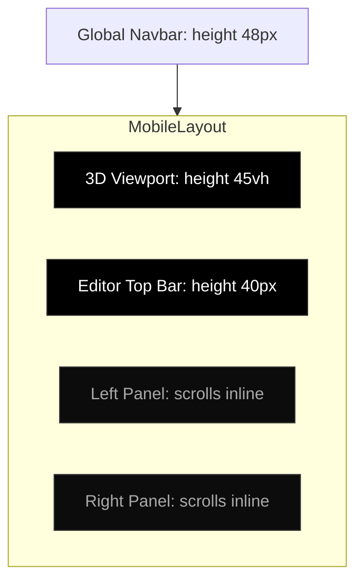

# ParaForm UI Design System
## High-Contrast Dark Terminal Aesthetic

This document defines the core tokens, design guidelines, components list, and interactive patterns for the **ParaForm UI Design System**. It serves as the single source of truth for maintainability, ensuring that future pages and layouts preserve the high-contrast, ultra-compact terminal atmosphere.

---

## 📐 Layout Architecture

To maximize screen utility in a 3D modeling environment, ParaForm uses a fully-docked modular workspace rather than floating overlapping containers. 

### Landing Page Alignment Grid
To keep the public brand onboarding space visually cohesive and clean:
* The Landing Page container has a maximum column boundary locked at `1200px` and centered with `margin: 0 auto;`.
* Both the primary `.hero` panel and all supplementary `.landing-section` blocks (including features grids, manifestos, and workflow panels) are bound to a strict horizontal padding limit of `16px`. This guarantees that all vertical gutters and borders align perfectly with grid coordinates on all monitors.

### Desktop Grid Layout
On viewport widths above `768px`, the studio docks panels flush with the screen edges:



### Mobile Stacked Layout
On viewports below `768px`, columns collapse into a vertical stack to optimize interaction:


### Floating Panels Route Isolation
To prevent WebGL rendering layer clipping and maximize OpenSCAD WASM compiler state stability, the main sidebars (`#config-panel` and `#info-panel`) exist outside the router's `#view-router` container. 

To prevent them from displaying on non-editor routes (like the Landing Page or Explore Library):
* They are tagged with the `.hidden-global` utility class which sets `display: none !important` by default.
* When the router transitions to the Studio workspace (`#/create`), the `body.in-editor` state is activated, which overrides the hidden rule with `display: flex !important`, bringing the sidebar docks into view synchronously.

---

## 🎨 Design System Tokens

Design system tokens are mapped to CSS custom variables in [style.css](file:///c:/Users/Chirag/Documents/3d_play/style.css#L1-L26). When writing styles, **always** refer to these custom tokens:

| Token | CSS Value | Application |
| :--- | :--- | :--- |
| `--bg-color` | `#000000` | Canvas base, main page background |
| `--panel-bg` | `#0c0c0c` | Workspace sidebar body |
| `--panel-header-bg` | `#141414` | Tab row & top bar headers |
| `--accent-color` | `#00ff66` | Primary active states, compilation indicators |
| `--accent-dim` | `#00aa44` | Secondary indicators, inactive range tracks |
| `--text-primary` | `#ffffff` | Primary text, titles, numeric manual inputs |
| `--text-secondary` | `#aaaaaa` | Secondary labels, descriptions |
| `--text-muted` | `#666666` | Developer notes, code comments, hints |
| `--border-color` | `#333333` | Standard structural borders |
| `--border-active` | `#00ff66` | Focused inputs, hovered cards, active badges |
| `--border-focus` | `#ffffff` | Absolute focus/selection borders |
| `--font-main` | `'JetBrains Mono', monospace` | Main body copy |
| `--border-radius` | `0px` | Strict rigid block style |

> [!IMPORTANT]
> **MINIMUM FONT SIZE BOUND**: Never declare `font-size` smaller than `12px` (including headers, captions, badges, or numeric inputs). This is critical for legibility in dense high-contrast layouts.
>
> **SHADOWS & BLUR BAN**: Do not add `box-shadow`, `text-shadow`, or `backdrop-filter: blur(...)` to any class or inline styling. This is strictly prohibited to preserve the raw CLI aesthetic.

---

## 📦 Component Specifications & Code Snippets

### 1. Unified Snap Buttons
Buttons use pure outline or solid styles with instant visual inversion on hover. **Do not use transitions/easings.**

```html
<!-- Primary action button (Solid neon terminal green) -->
<button class="primary-btn">Export STL</button>

<!-- Secondary action button (Monochrome border) -->
<button class="secondary-btn">Save Project</button>

<!-- Outline indicator button (Bordered neon green) -->
<button class="outline-btn">Browse Library</button>
```

```css
.primary-btn {
    background: var(--accent-color);
    color: #000000;
    border: 1px solid var(--accent-color);
    font-size: 12px;
    font-weight: bold;
    font-family: var(--font-mono);
    text-transform: uppercase;
    cursor: pointer;
    border-radius: 0px;
}
.primary-btn:hover {
    background: #ffffff;
    color: #000000;
    border-color: #ffffff;
}
```

### 2. Form & Select Controls
Forms require absolute high-contrast fields to stand out on dark panels:

```html
<!-- Standard text/code parameter input -->
<input type="text" class="glass-input" placeholder="Enter parameter...">

<!-- Snappy dropdown picker selection -->
<select class="glass-select">
    <option value="both">Show Both</option>
    <option value="box">Show Box</option>
</select>
```

### 3. Compact Number Fields (Manual overrides)
Inputs sit alongside range sliders for instant numeric adjustment.

```html
<div class="param-label">
    <span>Width</span>
    <input type="number" class="manual-input" value="80" step="1">
</div>
<input type="range" min="40" max="150" step="1" value="80">
```

```css
.manual-input {
    width: 64px;
    background: #111111;
    border: 1px solid var(--border-color);
    color: var(--accent-color);
    font-family: var(--font-mono);
    font-size: 12px;
    text-align: right;
    padding: 2px 4px;
    outline: none;
}
.manual-input:focus {
    border-color: var(--border-active);
}
```

### 4. Sliders (Terminal Range Dial)
To optimize touch and drag accuracy, the slider has an expanded vertical interactive height of `32px` and uses a `16px` tactile square thumb.

```css
input[type="range"] {
    -webkit-appearance: none;
    width: 100%;
    background: transparent;
    margin: 0;
    padding: 10px 0;               /* Vertically expands the interactive area */
    height: 32px;                  /* Direct target size expansion */
    cursor: pointer;
}

input[type="range"]::-webkit-slider-runnable-track {
    height: 4px;
    background: #111111;
    border: 1px solid var(--border-color);
}

input[type="range"]::-webkit-slider-thumb {
    -webkit-appearance: none;
    height: 16px;                  /* Increased size for touch accuracy */
    width: 16px;                   /* Increased size for touch accuracy */
    background: var(--accent-color);
    border: 1px solid #000000;
    margin-top: -6px;              /* Center aligned on 4px track */
    cursor: pointer;
    border-radius: 0px;            /* STRICT RIGID SQUARE THUMB */
}

/* Firefox Support */
input[type="range"]::-moz-range-track {
    height: 4px;
    background: #111111;
    border: 1px solid var(--border-color);
}

input[type="range"]::-moz-range-thumb {
    height: 16px;
    width: 16px;
    background: var(--accent-color);
    border: 1px solid #000000;
    cursor: pointer;
    border-radius: 0px;
}
```

### 5. Boolean Toggles (Solid Check-slider)
Uses quick-snapping box blocks instead of round pills.

```html
<label class="switch">
    <input type="checkbox" checked>
    <span class="slider-round"></span>
</label>
```

```css
.switch {
    position: relative;
    display: inline-block;
    width: 32px;
    height: 16px;
}
.switch input { opacity: 0; width: 0; height: 0; }
.slider-round {
    position: absolute;
    cursor: pointer;
    inset: 0;
    background-color: #111111;
    border: 1px solid var(--border-color);
    border-radius: 0px;
}
.slider-round:before {
    position: absolute;
    content: "";
    height: 10px;
    width: 10px;
    left: 2px;
    bottom: 2px;
    background-color: #666666;
    border-radius: 0px;
}
input:checked + .slider-round {
    background-color: #002208;
    border-color: var(--accent-color);
}
input:checked + .slider-round:before {
    transform: translateX(16px);
    background-color: var(--accent-color);
}
```

### 6. Status Diagnostics Badges
Colored markers representing background CAD parser and rendering status.

```html
<span id="status-badge" class="loading">Rendering...</span>
<span id="status-badge" class="success">Ready</span>
<span id="status-badge" class="error">Compilation Failure</span>
```

### 7. Context-Based Navbar Variants
The global navbar (`#global-nav`) dynamically renders specialized links, dropdown submenus, and action triggers based on the active routing workspace context to prevent button redundancy.

* **Studio Mode Variant (`#/create`)**:
  * **Pure Icon Branding**: Displays strictly the scaled `20px` hex-brand icon (`⬢`) on the left (hiding the logo text and editor badges) to maximize active workspace area and provide a sleek, pro desktop aesthetic.
  * Replaces navigation links with a **Desktop-Style Menu Bar** containing context-sensitive dropdown actions:
    * **File ▾**:
      * `📁 Open Model` -> Triggers the Studio library modal.
      * `💾 Save Design` -> Local storage cache saving (source and active parameters).
      * `📤 Export STL` -> Compiles and triggers immediate STL mesh download.
      * `Exit Studio` -> Safely exit to catalog.
    * **View ▾**:
      * `🎥 Reset Camera` -> Resets Three.js orbital limits.
      * `🕸️ Toggle Wireframe` -> Switches renderer wireframe mode.
    * **Settings ▾**:
      * `🚀 Performance Mode` -> Toggles Turbo low-fn drag resolution.
      * `📋 Show Diagnostics` -> Jumps viewport bounds focus to diagnostic metrics.
  * **Left-Docking Alignment**: Docks the dropdown menu bar directly to the left, flush against the brand logo with a clean `24px` horizontal gap to emulate classic native desktop applications (e.g. Blender, VS Code), pushing action controls to the far right margin.
  * Hides the redundant `Launch Studio` button.
  * Appends a dynamic `Save Project` button in action items if the user is authenticated.

* **Website Mode Variant (All other pages)**:
  * Restores primary web links: `Home`, `Explore`, and `Manage` (for authenticated admins).
  * Restores standard branding elements, including the brand text `ParaForm` next to the hex icon.
  * Displays the standard `Launch Studio` call-to-action prominently.

### 8. Studio Library Selector Components
To ensure high visual quality and functional robustness in the model selection process:
* **Tactile Mini Cards (`.mini-card`)**: Fully customized outline cards featuring parameter count badges, muted terminal system ID indicators, truncated descriptions, and an active loading hover overlay (`➔ LOAD MODEL`) that triggers instant WebGL template switching.
* **Scrollable Lock Panels**: Large selection dialogs use custom vertical scroll locks (`overflow-y: auto;` bound to modal heights) and are styled with blocky high-contrast terminal scrollbars to prevent viewport spillages.
* **Command Bar Inputs**: Search inputs are styled as custom square text field commands in standard terminal format.

---

## 🧑‍💻 Code Guidelines for Future Editors
Please read these instructions before modifying the codebase:

> [!WARNING]
> **1. BORDER RADII RULE**: Do not use `border-radius` larger than `2px` for normal interfaces, and strictly use `0px` (square corners) on primary panels, buttons, selects, and dialog overlays.
> 
> **2. TRANSITIONS & DAMPING**: Never apply cubic-bezier animations or long `transition: all 0.3s` rules. A retro terminal system must react instantly. Hover, click, and display states should swap *instantly* (`transition: none;`).
> 
> **3. SCROLLBAR INTEGRITY**: Avoid standard operating system scrollbars which disrupt dark themes. Utilize the custom scrollbars declared in [style.css:L114](file:///c:/Users/Chirag/Documents/3d_play/style.css#L114-L125).
> 
> **4. NO FLOATING GAPS**: Keep sidebars aligned flush with the navbar and screen edges inside the configurator screen. Do not inject margin pads between docked elements.
> 
> **5. COMPREHENSIVE RESPONSIVENESS**: Every layout must support mobile devices down to `320px` width. Avoid vertical container clipping by using flex-wrap or horizontal swipe containers (`overflow-x: auto; scrollbar-width: none;`) for filter sets. Always stack multi-column rows into single-column grids on screens `<= 768px`, and enforce min-heights on the code editor workspace wrappers (`380px`) to prevent functional collapse.
